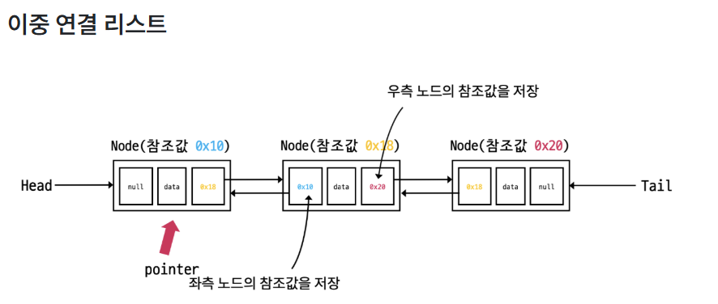
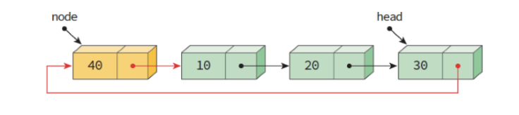

선형 자료 구조란?
- 요소가 일렬로 나열되어 있는 자료 구조

 

## 5.2.1 연결 리스트

데이터를 감싼 노드를 포인터로 연결해서 공간적인 효율성을 극대화 시킨 자료구조

삽입과 삭제가 O(1)이 걸리며 탐색에는 O(n)이 걸린다.

**head** 연결 리스트의 시작으로 첫 번째 노드를 가리키는 노드

**node** 데이터와 다음 노드로 접근할 수 있는 참조값을 가짐

**pointer** 노드의 참조값을 가리키는 변수

> **단일 연결**: next 포인터만 가짐

> **이중 연결**: next 포인터와 prev 포인터를 가짐

> **원형 이중 연결**: 이중 연결 리스트와 같지만 마지막 노드의 next 포인터가 헤드 노드를 가리키는 것

 

## 5.2.2 배열

같은 타입의 변수들로 이루어져 있고, 크기가 정해져 있으며, 인접한 메모리 위치에 있는 데이터를 모아놓은 집합

"중복 허용, 순서 있음"

- 참조에 O(1) 시간복잡도를 가지며 랜덤 접근이 가능하다.

- 삽입과 삭제에는 O(n)이 걸린다

 

- **참조**를 많이 하는 것은 배열이 좋다

- **데이터 추가와 삭제**를 많이 하는 것은 연결리스트

 

### 랜덤 접근과 순차적 접근

- 랜덤(임의) 접근: 데이터를 저장된 위치에 상관없이 직접 접근하여 읽거나 쓰는 방식
- 순차적 접근: 데이터를 저장된 순서대로 검색한다

> 따라서 연결리스트는 랜덤 접근이 불가능 하다.

n 번째 요소에 접근은 배열이 빠르다. 

 

## 5.2.3 벡터

동적으로 요소를 할당할 수 있는 동적 배열

" 중복 허용, 순서 있음, 랜덤접근 가능 "

- 탐색과 맨 뒤의 요소를 삭제, 삽입 시 O(1)
- 맨 뒤 아닌 요소 삭제, 삽입 시 O(n)

'''
뒤에서 부터 삽입 = push_back()

push_back()은 매번 크기가 증가하는 것이 아니라, 2의 제곱승+1 마다 크기를 2배로 늘림

맨 뒤 지우는 pop_back(), 그냥 지우는 erase(), 요소 찾는 find() 등 c++ 함수가 있음
'''

- 파이썬에서는 리스트가 벡터와 유사한 역할을 한다!!

 

## 5.2.4 스택

LIFO (last in first out)

후입 선출

- 재귀적인 함수, 알고리즘에 사용. ex) 웹브라우저 방문 기록

- 삽입 삭제에 O(1)
- 탐색에 O(n)

push() pop()

 

## 5.2.5 큐

FIFO (first in first out)

선입선출

- 삽입 삭제에 O(1)
- 탐색에 O(n)

ex) CPU 작업 기다리는 프로세스, 네트워크 접속 기다리는 행렬, BFS 등에 사용