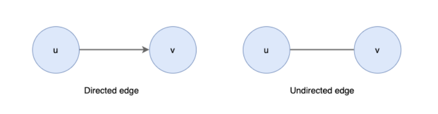
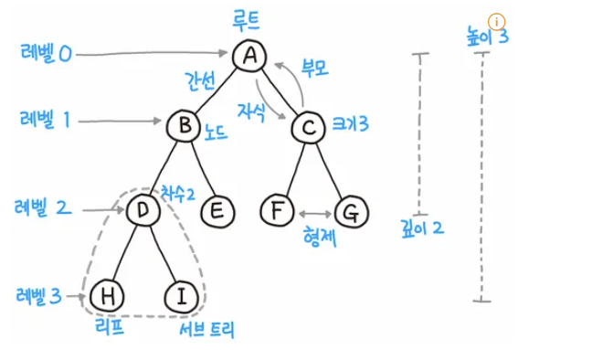
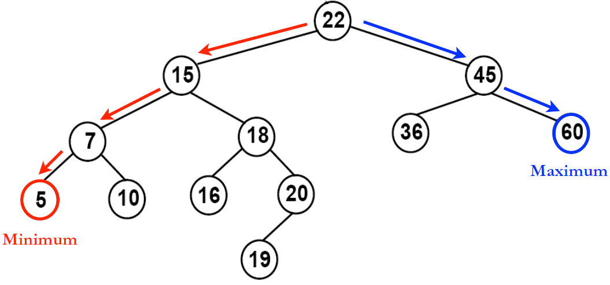
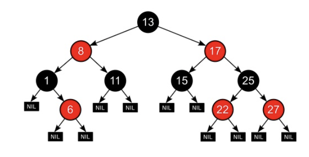
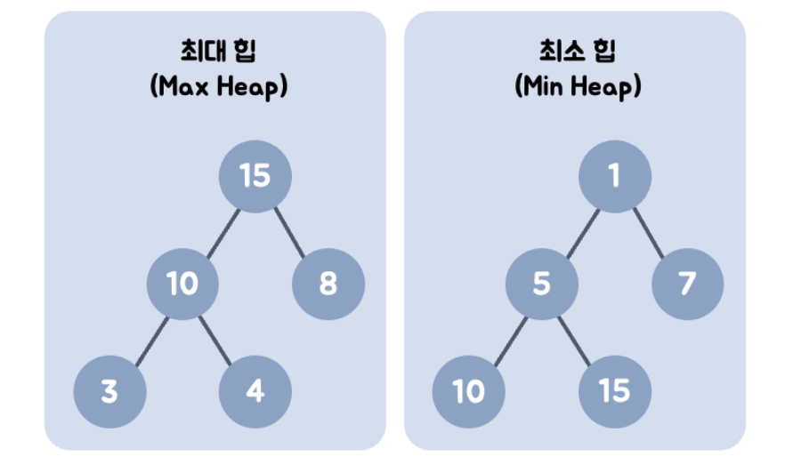
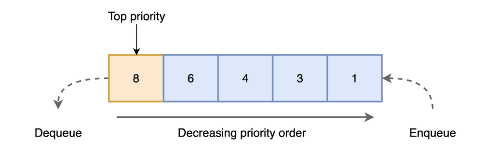
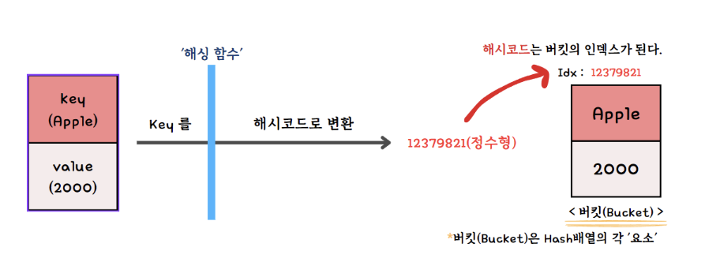
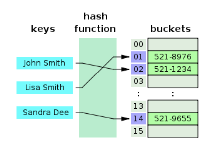

비선형구조란?
- 일렬로 나열하지 않고 자료 순서나 관계가 복잡한 구조
- 트리나 그래프

## 5.3.1 그래프
 
정점과 간선으로 이루어진 자료 구조

- 정점: 어떠한 곳
- 간선: 어떠한 곳을 가기 위한 통로

- 단방향 간선 : 한 쪽 방향으로만 이동 가능
- 양방향 간선 (무향)

- 가중치: 간선과 정점 사이에 드는 비용

 

## 5.3.2 트리
그래프 중 하나.

- 트리 구조로 배열된 일종의 계층적 데이터의 집합

- 트리로 이루어진 집합 = 숲

- 트리가 그래프의 일종이지만 아래의 특징을 갖는다는 점이 다름
    - 부모, 자식 계층 구조를 가짐
    - v-1 = E  간선수=노드수-1
    - 임의의 두 노드 사이에는 경로가 반드시 있다

 

### 트리의 구성

- 루트 노드: 가장 위에 있는 노드
- 내부 노드: 루트 노드와 리프 노드 사이에 있는 노드
- 리프 노드: 자식 노드가 없는 노드 

### 트리의 높이와 레벨

- 깊이: 루트 노드부터 특정 노드 까지 최단 거리로 갔을때의 거리
- 높이: 루트 노드부터 리프 노드까지 거리 중 가장 긴 거리
- 레벨: 보통은 = 깊이
- 서브트리: 트리 내의 하위 집합

### 이진 트리
자식 노드 수가 두개 이하인 트리

 

- 전 이진 트리 (Full Binary Tree):

모든 노드가 0개 또는 2개의 자식 노드를 갖는 트리

- 완전 이진 트리 (Complete Binary Tree):

마지막 레벨을 제외한 모든 레벨이 꽉 차 있고, 마지막 레벨은 왼쪽부터 차례대로 채워지는 트리

- 포화 이진 트리 (Perfect Binary Tree):

모든 노드가 2개의 자식 노드를 가지고 모든 레벨이 꽉 차 있는 트리

- 균형 이진 트리 (Balanced Binary Tree):

각 노드의 왼쪽과 오른쪽 자식 트리 간 높이 차이가 일정 범위를 넘지 않는 트리

- 변질 이진 트리 (Degenerate binary tree):

자식 노드가 하나밖에 없는 이진 트리

 

### BST 이진 탐색 트리

이진 탐색 트리는 노드의 오른쪽 하위 트리에는 '노드 값보다 큰 값'이 있는 노드만 포함,

왼쪽 하위 트리에는 '노드 값보다 작은 값'이 들어 있는 트리

=> '검색'하기에 용이 해짐.

따라서 이진 탐색 트리의 경우 O(log n) 시간이 걸림. 최악의 경우 O(n)

 

### AVL 트리

최악의 경우 선형적인 트리가 되는 것을 방지하고 스스로 균형을 잡는 이진 탐색 트리.

두 자식 서브트리의 높이는 항상 최대 1만큼 차이가 남

> 선형적인 트리 형태를 가질 때의 최악의 경우를 배제하고, 항상 균형 잡힌 트리로 만들자는 것

 

### 레드 블랙 트리
균형이진 탐색트리로 탐색, 삽입, 삭제 모두 시간 복잡도가 O(log n) 

> 모든 리프 노드와 루트 노드는 블랙이고 어떤 노드가 레드이면 그 노드의 자식은 반드시 블랙이다

이 규칙을 기반으로 균형을 잡는 트리임

 

## 5.3.3 힙

완전 이진 트리 기반의 자료구조.

최소힙과 최대힙 두가지로 이루어짐

- 최대 힙: 루트 노드가 가장 큼

- 최소 힙: 루트 노드가 가장 작음

각 부모를 기준으로 왼쪽이 작고, 오른쪽이 큰 구조

 

- 힙의 삭제와 삽입
    - 새로운 요소 삽입 및 삭제시. 스왑으로 힙이 재구성 됨

 

## 5.3.4 우선순위 큐

= 우선 순위 대기열

우선순위가 높은 요소가 우선순위가 낮은 요소 보다 먼저 제공되는 자료 구조

- 파이썬은
기본적으로 최소힙

 

## 5.3.5 맵

특정 순서에 다라 키와 매핑된 값의 조합으로 형성된 자료구조

레드 블랙 트리 자료 구조를 기반으로 형성, 삽입하면 자동으로 정렬됨

+ 해시맵

 

## 5.3.5 셋

set은 특정 순서에 따라 고유한 요소를 저장하는 컨터이너. 

중복되는 요소는 없고 오로지 unique한 값만 저장하는 자료구조

 

## 5.3.7 해시테이블

- 무한에 가까운 데이터들을 유한한 개수의 해시 값으로 매핑한 테이블.

- 빠르고 효율적으로 데이터 탐색이 가능함. 

- 키를 통해 접근하기에 직접접근이 가능

- 삽입, 삭제, 탐색 시 평균적으로 O(1)의 시간 복잡도를 가지며 unordered_map으로 구현함.

